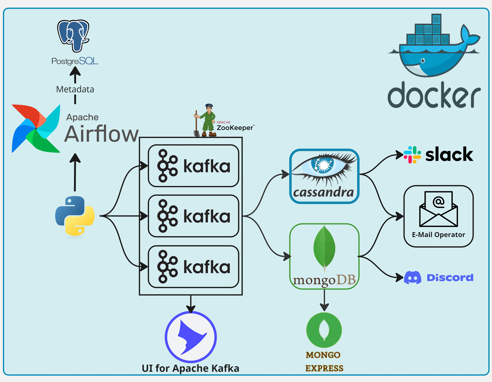

# e2e-otp-pipeline
End to End OTP Pipeline Project using Docker, Airflow, Kafka, KafkaUI, Cassandra, MongoDB, EmailOperator, SlackWebhookOperator and DiscordWebhookOperator

## Project Overview

Project contains 3 Kafka brokers, UI for Apache Kafka, Zookeeper, Cassandra, Mongo, Mongo-Express, airflow-init, postgres, airflow-webserver, airflow-scheduler, airflow-triggerer, airflow-cli containers.

The Pipeline performs 
1. creating a kafka topic named email_topic with 3 partitions, write an email address at a time triggered by user.
2. creating cassandra keyspace and table named email_namespace and email_table and consuming kafka topic messages into cassandra.
3. creating mongodb database and collection named email_database and email_collection and consuming topic messages into mongodb.
4. checking existence of the email and otp code in these two databases and pushing email notifications, slack channel messages and discord messages simultaneously.

## Configuring Email Notifications in Airflow

### Obtain an App Password for your Microsoft Account:

- Go to the Security tab and select Manage how I sign in to Microsoft.
- Create a new app password as instructed.
- For detailed guidance, refer to the [Microsoft support article](https://support.microsoft.com/en-us/account-billing/how-to-get-and-use-app-passwords-5896ed9b-4263-e681-128a-a6f2979a7944).

#### Update docker-compose.yaml file

AIRFLOW__SMTP__SMTP_HOST='smtp-mail.outlook.com' \
AIRFLOW__SMTP__SMTP_MAIL_FROM='your_email@outlook.com' \
AIRFLOW__SMTP__SMTP_USER='your_email@outlook.com' \
AIRFLOW__SMTP__SMTP_PASSWORD='your_app_password' \
AIRFLOW__SMTP__SMTP_PORT='587' \
AIRFLOW__SMTP__SMTP_STARTTLS='True' \
AIRFLOW__SMTP__SMTP_SSL='False' \
AIRFLOW__SMTP__SMTP_TIMEOUT='5' \
AIRFLOW__SMTP__SMTP_RETRY_LIMIT='3' 

### Setting up receiver emails using using [MailSlurp](https://www.mailslurp.com/).
- Sign up for a free account.
- From inboxes section create several temporary email addresses.
- In the emails section find and copy the email addresses into email_list.txt file in your project directory before running.

## Setting up Slack

- Go to your apps section of [Slack api website](https://api.slack.com/apps).
- Create an app from scratch.
- Assign the app to your workspace.
- After creating your app, go to incoming webhooks section from dropdown menu and toggle Activate Incoming Webhooks.
- Go to bottom of the page and add new webhook to workspace, assign it to data-engineering channel.
- In the Webhook URL section, you can copy your information, that will be used in airflow connection setup.

## Setting up Discord

- Go to Discord Web or Desktop [Application](https://discord.com/).
- Create a server at the bottom of the lef pane of servers, for create my own, for me and for my friends, name it whatever you want.
- Forward to Server Settings, Go to Apps/Integrations/Webhooks, Create Webhook. That will create a default webhook. Copy Webhook URL, and store it for airflow connection setup.

## Initialize the containers using docker_run.sh shell script:

`$ ./docker_run.sh`

**This will create required uid variable, network named cassandra-kafka and initialize the postgres database that holds the airflow metadata, download the container images and finally start the project containers which will be orchestrated by airflow.**

#### WebUI Links:

`Airflow`       : <http://localhost:8080/> \
    Username: `admin` Password: `admin`

`Kafka UI`      : <http://localhost:8888/> 

`Mongo Express` : <http://localhost:8082> \
    Username: `admin` Password: `pass`

**Access the cassandra shell using :**

`$ docker exec -it cassandra cqlsh -u cassandra -p cassandra`

### Establish airflow connections for slack and discord from Admin/Connections panel.

- Use Webhook URL obtained from slack app and add a new record.

Connection Id *         : slack_webhook \
Connection Type *       : Slack Incoming Webhook \
Slack Webhook Endpoint	: hooks.slack.com/services \
Webhook Token	        : T00000000/B00000000/XXXXXXXXXXXXXXXXXXXXXXXX (found in the webhook url, usually starts with "T")

- Use Copied Webhook URL from Discord and add a new record.

Connection Id *         : discord_webhook \
Connection Type *       : Discord \
Host                    : https://discord.com/api/ \
Webhook Endpoint        : webhooks/{webhook.id}/{webhook.token} (found in the webhook url)

### Trigger the main_dag several times.

**Once you triggered the dag you can track created kafka messages from [kafka-ui](http://localhost:8888), data inserted into cassandra table using cassandra shell (cqlsh) and inserted documents into mongodb from [mongo-express-ui](http://localhost:8082)**
